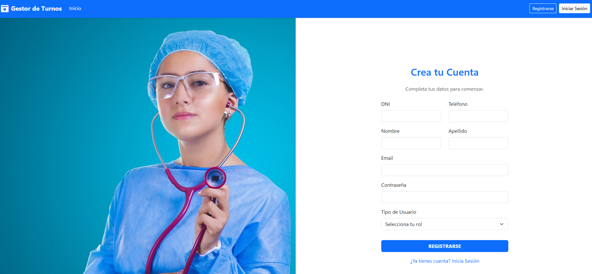

# Gestor de Turnos Médicos - Proyecto Java Web

Aplicación web completa para la gestión de turnos médicos, desarrollada con Java Servlets, JSP y MySQL. El proyecto implementa un CRUD completo siguiendo patrones de diseño como DAO y se enfoca en una experiencia de usuario (UX/UI) moderna y accesible (WCAG).


*(Reemplazá 'readme-img.png' con el nombre de tu captura de pantalla)*

---

## 📋 Objetivos del Proyecto

Este proyecto fue desarrollado como parte de la materia Programación I y Práctica Profesionalizante I, cumpliendo con los siguientes requisitos:

- [x] **Estructura de Carpetas:** Aplicar la estructura estándar de Maven Webapp y organización por paquetes.
- [x] **CRUD Completo:** Implementar las operaciones Create, Read, Update y Delete para el modelo de Turnos.
- [x] **Patrones de Diseño:** Utilizar interfaces genéricas para el DAO (`DAO.java`) y el administrador de conexiones (`AdmConection.java`).
- [x] **Gestión de Dependencias:** Usar Apache Maven para gestionar todas las librerías (JSTL, MySQL Connector, Jakarta EE).
- [x] **Framework CSS:** Diseñar la interfaz con Bootstrap 5.
- [x] **Principios de UX/UI:** Crear un flujo de usuario lógico, con feedback visual (alertas) y componentes que facilitan las tareas (ej: alta rápida de pacientes).
- [x] **Accesibilidad (a11y):** Implementar estándares WCAG y atributos ARIA para una navegación accesible mediante lectores de pantalla y teclado.
- [x] **Documentación:** Incluir este README y el script de la base de datos.

---

## ✨ Características Principales

* **Autenticación de Usuarios:** Sistema de Registro y Login para Médicos y Pacientes.
* **Navegación Dinámica:** La barra de navegación y la página de inicio se adaptan según si el usuario está logueado y según su rol (Médico o Paciente).
* **Gestión de Turnos (CRUD):**
    * **Crear:** Formulario para crear nuevos turnos.
    * **Leer:** Tabla con listado de todos los turnos.
    * **Actualizar:** Formulario para editar la información de un turno existente.
    * **Eliminar:** Opción para eliminar un turno (con diálogo de confirmación).
* **Filtrado de Datos:** La tabla de gestión permite filtrar los turnos por su estado (Pendiente, Confirmado, etc.).
* **Accesibilidad WCAG:** Toda la aplicación es navegable por teclado y compatible con lectores de pantalla.

---

## 🛠️ Tecnologías Utilizadas

* **Backend:**
    * Java 17
    * Jakarta Servlets 6.0
    * Jakarta Server Pages (JSP) 3.1
    * JSTL 3.0
* **Frontend:**
    * HTML5 (Semántico y Accesible)
    * Bootstrap 5.3
    * ARIA (Accessible Rich Internet Applications)
* **Base de Datos:**
    * MySQL 8.x
* **Servidor y Build:**
    * Apache Tomcat 10.1
    * Apache Maven

---

## 🚀 Puesta en Marcha

Sigue estos pasos para ejecutar el proyecto localmente:

### 1. Prerrequisitos
* JDK 17 o superior.
* Un servidor MySQL en funcionamiento.
* Apache Maven.
* Un servidor de aplicaciones como Apache Tomcat 10.1.
* Un IDE (se utilizó IntelliJ IDEA).

### 2. Script de la Base de Datos
El script para la creación de la base de datos (`db_turnos_medicos`) y sus tablas se encuentra en el archivo:

* **`gestor_turnos.sql`**

Ejecuta este archivo en tu gestor de base de datos MySQL (Workbench, DataGrip, etc.) para crear la estructura necesaria.

### 3. Configurar la Conexión
Abre el archivo `src/main/java/org/progI/interfaces/AdmConection.java` y modifica las constantes `dbUser` y `dbPass` con tu usuario y contraseña de MySQL.

```java
public interface AdmConection {
    // ...
    // pass bd
    String dbUser = "root"; // <-- Cambia esto
    String dbPass = "tu_contraseña"; // <-- Cambia esto
    // ...
}